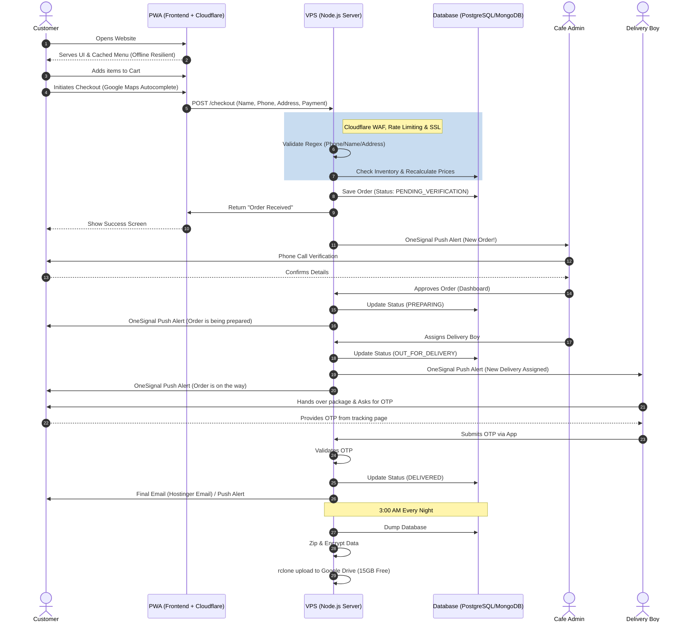
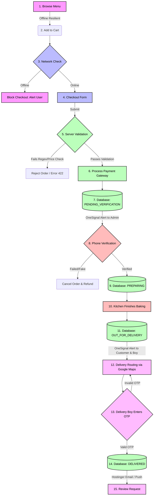

# Master Architecture & Workflow Pipeline

This document visualizes the complete "chain" of workflows (Customer Journey, Offline Resilience, Validation, Notifications, and Delivery) into a single, cohesive master pipeline.

## 1. End-to-End Sequence Diagram
This diagram shows the exact step-by-step communication between all entities on the platform.

## 2. Order State Machine (The "Block" Chain)
This flowchart visualizes the strict path an order takes. An order cannot skip a block in the chain, ensuring absolute data integrity and preventing fake deliveries.

## 3. Technology Pipeline Summary

*   **Frontend (The Face):** Cloudflare Pages + Service Workers (Offline browsing) + Google Maps Autocomplete + OneSignal Web Push.
*   **Security (The Shield):** Cloudflare WAF + Origin Certificate (End-to-End SSL) + Server-side Regex validation.
*   **Backend (The Brain):** Hostinger KVM 2 VPS (Node.js/Express) + strict state machines + Payment Gateway logic.
*   **Database (The Memory):** PostgreSQL/MongoDB + 3:00 AM Cron Job sending Zipped dumps to Google Drive via `rclone`.
*   **Communication (The Voice):** Hostinger Business Email (`hello@cafe.com`) + OneSignal Alerts + Manual Verification Calls.
