# Admin Dashboard PWA: Architecture Flowchart

This diagram visualizes the "Mission Control" center of the cafe, illustrating how the Manager monitors live operations, handles custom orders, and controls marketing configurations.

```mermaid
flowchart TD
    %% Global Nav
    NAV[Main Menu / Sidebar]
    KILL[Master Kill Switch: Stop Accepting Orders]

    %% Security
    Auth(("🔒 Admin Login (`/login`)"))
    Auth -->|Strict Cookie Auth <br/> No Registration| Dashboard

    %% Core Operations
    subgraph Operations [Live Core Operations]
        direction TB
        Dashboard(("📊 Live Orders (`/`)"))
        Pending[Pending Verification]
        FleetTrack[Live Fleet Tracking]
        
        Dashboard --> Pending
        Dashboard --> FleetTrack
        
        Pending -->|Call & Approve| Kitchen[Sent to Kitchen PWA]
        FleetTrack --> Rider[Monitor: Picked Up -> Reached -> Delivered]

        Custom(("🎂 Custom Cakes (`/custom-cakes`)"))
        Quarantine[Quarantine Queue]
        Nego[Call Customer & Negotiate]
        Override[Price Override Editor]
        
        Custom --> Quarantine
        Quarantine --> Nego
        Nego --> Override
        Override -->|Manager Approved| Kitchen
    end

    %% Inventory & Logistics
    subgraph Management [Inventory & Logistics]
        direction TB
        Menu(("🍔 Menu Manager (`/menu-manager`)"))
        Editor[Product Details Editor <br/> Dietary Tags & Pricing]
        Stock[Instant Out-of-Stock Toggles]
        AVIF[Upload .AVIF Images to R2]
        
        Menu --> Editor
        Menu --> Stock
        Menu --> AVIF

        Fleet(("🛵 Fleet Control (`/fleet`)"))
        Riders[View Available/Busy Riders]
        Assign[Manual Order Assignment]
        FloatingCash[Track Floating Cash from COD]
        Settle[Settle Cash Button <br/> Resets balance to 0]
        
        Fleet --> Riders
        Riders --> Assign
        Riders --> FloatingCash
        FloatingCash --> Settle
    end

    %% CRM & Marketing
    subgraph Marketing [CRM, Analytics & Promotions]
        direction TB
        Promo(("🎁 Promotions (`/promotions`)"))
        Coupons[Coupon Creator: Limits & Caps]
        Banners[Banners & Sticky Announcement Editor]
        Scratch[Scratch Card Toggle]
        
        Promo --> Coupons
        Promo --> Banners
        Promo --> Scratch

        History(("📜 History & Refunds (`/history`)"))
        Refund[Initiate Partial/Full Refunds <br/> COD refunds go to User Wallet]
        History --> Refund

        CRM(("⭐ CRM & Reviews (`/reviews`)"))
        Feedback[Live Customer Feedback]
        DeleteQueue[Account Deletion Requests]
        
        CRM --> Feedback
        CRM --> DeleteQueue

        Stats(("📈 Analytics (`/analytics`)"))
        Charts[Revenue Charts & Tax Reports]
        Stats --> Charts
    end

    %% Settings & Admin
    subgraph Config [System Configuration]
        direction TB
        Staff(("👥 Staff Provisioning (`/staff`)"))
        CreateRider[Create Delivery Boy Account]
        CreateChef[Create Kitchen Staff Account]
        
        Staff --> CreateRider
        Staff --> CreateChef
        
        Settings(("⚙️ Cafe Settings (`/settings`)"))
        DeliveryFee[Set Free Delivery Threshold]
        Settings --> DeliveryFee
    end

    %% Force Vertical Stacking (Invisible Links)
    Dashboard ~~~ Menu
    Menu ~~~ Promo
    Promo ~~~ Staff
    Staff ~~~ KILL

    %% Styling (High Contrast)
    style Auth fill:#FFEB3B,stroke:#F57F17,color:#000000
    style Dashboard fill:#E3F2FD,stroke:#1565C0,color:#000000
    style Custom fill:#FCE4EC,stroke:#C2185B,color:#000000
    style Menu fill:#FFF3E0,stroke:#EF6C00,color:#000000
    style Fleet fill:#E8F5E9,stroke:#2E7D32,color:#000000
    style Promo fill:#F3E5F5,stroke:#6A1B9A,color:#000000
    style History fill:#ECEFF1,stroke:#607D8B,color:#000000
    style CRM fill:#FFF9C4,stroke:#FBC02D,color:#000000
    style Stats fill:#E0F7FA,stroke:#00838F,color:#000000
    style Staff fill:#FFCCBC,stroke:#D84315,color:#000000
    style Settings fill:#CFD8DC,stroke:#455A64,color:#000000
    style Kitchen fill:#D32F2F,stroke:#333,color:#ffffff
    style KILL fill:#D32F2F,stroke:#333,color:#ffffff
    
    classDef default fill:#ffffff,stroke:#333,color:#000000
```

