# Customer PWA: Architecture Flowchart

This diagram maps out the complete user journey and page hierarchy for the Customer PWA, highlighting the strict conversion funnel and post-purchase retention loops.

```mermaid
flowchart TD
    %% Global UI Elements
    subgraph Global [Always Visible UI]
        direction LR
        ANN[Sticky Announcement Bar]
        NAV[Navbar & Cart Icon]
    end

    %% Entry Point
    Home(("🏠 Home / Landing (`/`)"))
    Home -->|Hero Promo Banners| Banners[Horizontal Banner Carousel]
    Home -->|CTA 1| Menu["Standard Menu (`/menu`)"]
    Home -->|CTA 2| Custom["Custom Cake Wizard (`/custom-cake`)"]
    
    %% Shopping Experience
    subgraph Browsing [The Shopping Funnel]
        direction TB
        Menu -->|Filter by Category| Category[Category Sidebar]
        Category --> ProductGrid[High-Res Product Cards]
        ProductGrid -->|Click Item| Details["Product Details (`/product/:id`)"]
        
        Custom --> Step1[Step 1: Flavor & Base]
        Step1 --> Step2[Step 2: Size & Weight]
        Step2 --> Step3[Step 3: Cake Message]
        Step3 --> Step4[Step 4: Ref Image Upload]
    end

    %% Cart & Promotion
    Details -->|Add to Cart| Cart
    Step4 -->|Add to Cart| Cart
    ProductGrid -->|Quick Add| Cart

    subgraph CartSection [Cart & Promos]
        Cart(("🛒 The Cart (`/cart`)"))
        Cart --> Offers[View Available Offers Drawer]
        Offers -->|Apply Coupon| Cart
        Cart -->|Dynamic Math| Total[Recalculate Final Price]
    end

    %% Security & Checkout
    Total -->|Proceed to Checkout| AuthCheck{Is User Logged In?}
    AuthCheck -->|No| Login["Auth (`/login`)"]
    
    subgraph AuthLayer [Firebase Authentication]
        Login --> Phone[Enter Phone Number]
        Phone -->|Firebase OTP| Legal["Legal Consent (T&C)"]
        Legal -->|Auto-Register or Login| Checkout
    end
    
    AuthCheck -->|Yes| Checkout
    
    subgraph CheckoutFlow [Checkout Phase]
        direction TB
        Checkout(("💳 Secure Checkout"))
        Checkout --> CheckAddr{Has Saved Address?}
        CheckAddr -->|Yes| Slider[Saved Address Slider]
        CheckAddr -->|No| Map[Step 1: Google Maps Pinpoint]
        Map --> Manual[Step 2: Type Flat No. & Landmark]
        Manual -->|Save as Home/Work| Slider
        Slider --> Pay[Payment Gateway <br/> Razorpay/Stripe]
    end

    %% Post-Purchase & Retention
    Pay -->|Payment Success| Track
    
    subgraph PostPurchase [Post-Purchase Journey]
        direction TB
        Track(("📍 Live Tracking (`/track/:id`)"))
        Track --> Timeline["Order Received -> Preparing -> Picked Up -> Reached Location"]
        Timeline --> DOTP[Display 4-Digit Delivery OTP]
        DOTP -->|Delivered| Bill["Digital Invoice (`/bill/:id`)"]
    end

    %% Retention Loop
    Bill --> Profile
    
    subgraph Retention [Retention & Profile]
        Profile(("👤 User Profile (`/profile`)"))
        Profile --> Hist[Order History & 1-Click Reorder]
        Profile --> AddrMgt[Address Book Management]
        Profile --> Scratch[Scratch Card Center <br/> Reveal Next-Order Coupon!]
    end
    
    Scratch -.->|Brings them back to| Home

    %% Styling (High Contrast)
    style Home fill:#E3F2FD,stroke:#1565C0,color:#000000
    style Cart fill:#FFF3E0,stroke:#EF6C00,color:#000000
    style Checkout fill:#E8F5E9,stroke:#2E7D32,color:#000000
    style Track fill:#FCE4EC,stroke:#C2185B,color:#000000
    style Profile fill:#F3E5F5,stroke:#6A1B9A,color:#000000
    style Login fill:#FFEB3B,stroke:#F57F17,color:#000000
    
    classDef feature fill:#ffffff,stroke:#333,stroke-width:1px,color:#000000
    class ANN,NAV,Banners,Menu,Custom,Category,ProductGrid,Details,Step1,Step2,Step3,Step4,Offers,Total,Phone,Legal,Slider,Map,Manual,Pay,Timeline,DOTP,Bill,Hist,AddrMgt,Scratch feature
```

