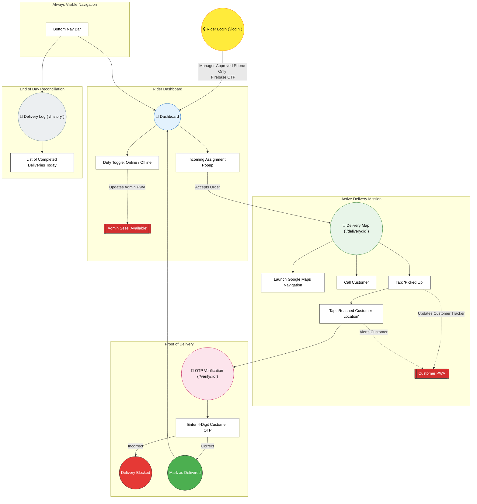

# Delivery Fleet PWA: Architecture Flowchart

This diagram visualizes the ultra-streamlined, one-handed operation flow designed exclusively for the cafe's delivery boys.

```mermaid
flowchart TD
    %% Global Nav
    subgraph Global [Always Visible Navigation]
        direction LR
        NAV[Bottom Nav Bar]
    end

    %% Security
    Auth(("🔒 Rider Login (`/login`)"))
    Auth -->|Manager-Approved Phone Only <br/> Firebase OTP| Dashboard

    %% Core Dashboard
    subgraph Core [Rider Dashboard]
        direction TB
        Dashboard(("🛵 Dashboard"))
        Dashboard --> Toggle[Duty Toggle: Online / Offline]
        Toggle -.->|Updates Admin PWA| Admin[[Admin Sees 'Available']]
        
        Dashboard --> Assignment[Incoming Assignment Popup]
    end

    %% Active Mission
    Assignment -->|Accepts Order| Active

    subgraph Mission [Active Delivery Mission]
        direction TB
        Active(("📍 Delivery Map (`/delivery/:id`)"))
        Active --> MapBtn[Launch Google Maps Navigation]
        Active --> CallBtn[Call Customer]
        
        %% Granular Status Updates
        Active --> Status1[Tap: 'Picked Up']
        Status1 -.->|Updates Customer Tracker| Cust1[[Customer PWA]]
        
        Status1 --> Status2[Tap: 'Reached Customer Location']
        Status2 -.->|Alerts Customer| Cust1
    end

    %% Security Check
    Status2 --> Verify

    subgraph SecurityCheck [Proof of Delivery]
        direction TB
        Verify(("🔐 OTP Verification (`/verify/:id`)"))
        Verify --> Keypad[Enter 4-Digit Customer OTP]
        Keypad -->|Incorrect| Block((Delivery Blocked))
        Keypad -->|Correct| Success((Mark as Delivered))
    end

    %% End of Mission
    Success --> Dashboard
    
    %% Log
    NAV --> Dashboard
    NAV --> History
    
    subgraph Log [End of Day Reconciliation]
        direction TB
        History(("📜 Delivery Log (`/history`)"))
        History --> List[List of Completed Deliveries Today]
    end

    %% Styling (High Contrast)
    style Auth fill:#FFEB3B,stroke:#F57F17,color:#000000
    style Dashboard fill:#E3F2FD,stroke:#1565C0,color:#000000
    style Active fill:#E8F5E9,stroke:#2E7D32,color:#000000
    style Verify fill:#FCE4EC,stroke:#C2185B,color:#000000
    style History fill:#ECEFF1,stroke:#607D8B,color:#000000
    
    style Admin fill:#D32F2F,stroke:#333,color:#ffffff
    style Cust1 fill:#D32F2F,stroke:#333,color:#ffffff
    style Success fill:#4CAF50,stroke:#333,color:#ffffff
    style Block fill:#E53935,stroke:#333,color:#ffffff
    
    classDef feature fill:#ffffff,stroke:#333,stroke-width:1px,color:#000000
    class NAV,Toggle,Assignment,MapBtn,CallBtn,Status1,Status2,Keypad,List feature
```
