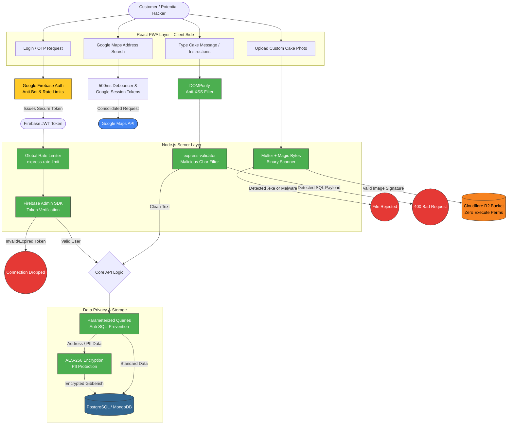

# Security Architecture Flowchart

This flowchart visualizes the gauntlet of security protocols that every user, request, and file must pass through before reaching the cafe's core database.

```mermaid
flowchart TD
    %% User Inputs
    User([Customer / Potential Hacker])

    %% Frontend Layer
    subgraph Frontend [React PWA Layer - Client Side]
        direction TB
        Login[Login / OTP Request]
        Address[Google Maps Address Search]
        Upload[Upload Custom Cake Photo]
        Text[Type Cake Message / Instructions]
    end

    User --> Login
    User --> Address
    User --> Upload
    User --> Text

    %% Frontend Defenses
    Login --> FB[Google Firebase Auth <br/> Anti-Bot & Rate Limits]
    Address --> DEB[500ms Debouncer & <br/> Google Session Tokens]
    Text --> DP[DOMPurify <br/> Anti-XSS Filter]
    
    FB -->|Issues Secure Token| JWT([Firebase JWT Token])
    DEB -->|Consolidated Request| MAPS([Google Maps API])
    
    %% Backend Layer
    subgraph Backend [Node.js Server Layer]
        direction TB
        LIMITER[Global Rate Limiter <br/> express-rate-limit]
        VERIFY[Firebase Admin SDK <br/> Token Verification]
        MULTER[Multer + Magic Bytes <br/> Binary Scanner]
        VALIDATE[express-validator <br/> Malicious Char Filter]
    end

    JWT --> LIMITER
    LIMITER --> VERIFY
    Upload --> MULTER
    DP --> VALIDATE

    %% Drop Zones
    VERIFY -->|Invalid/Expired Token| DROP1((Connection Dropped))
    MULTER -->|Detected .exe or Malware| DROP2((File Rejected))
    VALIDATE -->|Detected SQL Payload| DROP3((400 Bad Request))

    %% Success Paths
    VERIFY -->|Valid User| ROUTER{Core API Logic}
    VALIDATE -->|Clean Text| ROUTER
    MULTER -->|Valid Image Signature| R2[(Cloudflare R2 Bucket <br/> Zero Execute Perms)]

    %% Database Layer
    subgraph Data [Data Privacy & Storage]
        direction TB
        ORM[Parameterized Queries <br/> Anti-SQLi Prevention]
        AES[AES-256 Encryption <br/> PII Protection]
        DB[(PostgreSQL / MongoDB)]
    end

    ROUTER --> ORM
    ORM -->|Address / PII Data| AES
    AES -->|Encrypted Gibberish| DB
    ORM -->|Standard Data| DB

    %% Styling (High Contrast)
    style FB fill:#FFCA28,stroke:#333,color:#000000
    style MAPS fill:#4285F4,stroke:#333,color:#ffffff
    style R2 fill:#F6821F,stroke:#333,color:#000000
    style DB fill:#336791,stroke:#333,color:#ffffff
    style AES fill:#4CAF50,stroke:#333,color:#ffffff
    style MULTER fill:#4CAF50,stroke:#333,color:#ffffff
    style LIMITER fill:#4CAF50,stroke:#333,color:#ffffff
    style VERIFY fill:#4CAF50,stroke:#333,color:#ffffff
    style DP fill:#4CAF50,stroke:#333,color:#ffffff
    style ORM fill:#4CAF50,stroke:#333,color:#ffffff
    style VALIDATE fill:#4CAF50,stroke:#333,color:#ffffff
    style DROP1 fill:#E53935,stroke:#333,color:#ffffff
    style DROP2 fill:#E53935,stroke:#333,color:#ffffff
    style DROP3 fill:#E53935,stroke:#333,color:#ffffff
```
